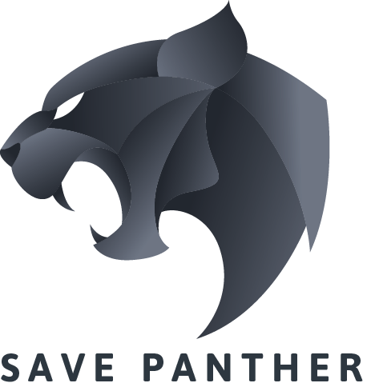

# Panther

SavePanther is an initiative to create awareness of endangered Panther species by creating unique Panther NFT Collectibles

## Problem:

Panthers are listed as an Endangered Species under the Endangered Species Act. Their protection and preservation is of utmost importance. We wanted to bring attention and create awareness of their conservation among our community.

## Our solution

We decided to mint exclusive NFT collectibles for raising fund to this cause. We designed our Panther art layers, generated them with random traits, coded our Panther NFT smart contracts based on ERC-721 token, deployed on Polygon Mumbai testnet, created a Dapp for accessing the deployed smart contracts and minting Panther NFT's, tested the minted NFT's on the collectibles section on Opensea testnet. We also validated NFT image rendering by accessing it on Metamask mobile wallet.

## How It's Made

Architecture:

- NFT 721 Panther contract
- PantherLottery and PantherTraits contracts implementing Chainlink VRF 
- React-based NFT Dapp to mint Panther NFT and participate in lottery.

Technologies

- UI - React, HTML/CSS
- IPFS: We store all NFT generated images on IPFS.
- Smart Contract - Solidity ERC-721, Chainlink VRF
- Backend - web3.js, Node.js
- Art Design - Adobe PhotoShop, Adobe Illustrator
- Art Engine - Modified Hashlips engine
- Testnet - Mumbai Polygon , Opensea
- Tools - Truffle, Remix, Metamask, Discord Bot (Collab.land)

## Starting the Dapp
- npm install
- npm start
- Note: Mac users need to add argument --openssl-legacy-provider inside "start": "react-scripts --openssl-legacy-provider start"

## Related source code repo

- Dapp - https://github.com/ramvittalkumar/pantherdapp
- Smart Contracts - https://github.com/ramvittalkumar/panther

